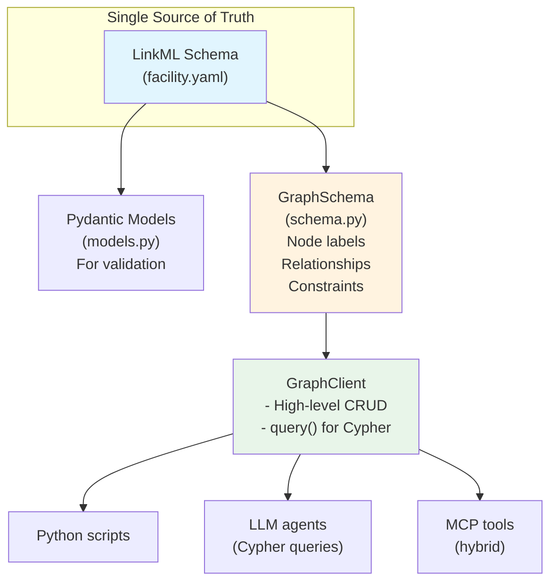

# Federated Fusion Knowledge Graph - Implementation Plan

**Status**: Active  
**Last Updated**: 2026-01-03  
**Based on**: EPFL/TCV exploration findings, LinkML ecosystem research

---

## 1. Executive Summary

Build a Neo4j-based knowledge graph that captures facility-specific knowledge discovered through exploration. The graph schema is defined in **LinkML** (`schemas/facility.yaml`) as the single source of truth.

### Architecture Decision



**Key insight from EPFL exploration**: The real value isn't in file paths—it's in the semantic relationships between:
- MDSplus trees and their node hierarchies
- TDI functions and the data they access
- Analysis codes (LIUQE, ASTRA, TORAY) and their inputs/outputs
- Diagnostic systems and their signals

---

## 2. Design Philosophy: LLM-First Cypher

Modern LLMs are excellent at writing Cypher queries. The architecture supports:

1. **Direct Cypher via `client.query()`** - Primary interface for LLM agents
2. **High-level Python methods** - Convenience for scripts and common operations  
3. **Schema enforcement** - GraphSchema generates constraints from LinkML

### Why This Approach?

| Approach | Pros | Cons |
|----------|------|------|
| Python-only accessors | Type-safe, IDE completion | Every query pattern needs code |
| Direct Cypher (LLM) | Infinite flexibility, LLMs excel at this | No compile-time checks |
| **Hybrid (chosen)** | Best of both worlds | Slightly more API surface |

### Query Pattern Examples

```python
from imas_codex.graph import GraphClient

with GraphClient() as client:
    # LLM-generated Cypher (recommended for complex/ad-hoc queries)
    result = client.query("""
        MATCH (code:AnalysisCode)-[:FACILITY_ID]->(f:Facility)
        WHERE code.code_type = 'equilibrium'
        RETURN f.id, collect(code.name) as equilibrium_codes
        ORDER BY size(equilibrium_codes) DESC
    """)
    
    # High-level method (convenience for common patterns)
    tools = client.get_tools("epfl")
    
    # Cross-facility comparison
    comparison = client.compare_facilities(
        "Diagnostic", 
        facility_ids=["epfl", "jet", "iter"]
    )
```

---

## 3. Multi-Facility Support

### Understanding `id` vs `facility_id`

Every facility-owned node has two key fields:

| Field | Purpose | Example |
|-------|---------|---------|
| `id`/`name`/`path` | **Identifier** - uniquely identifies within type | `"LIUQE"`, `"Thomson"` |
| `facility_id` | **Owner** - which facility this belongs to | `"epfl"`, `"jet"` |

**Both are required** to uniquely identify most nodes:

```
┌─────────────────────────────────────────────────────────────┐
│ AnalysisCode nodes in the graph:                            │
├─────────────────────────────────────────────────────────────┤
│ name: "EFIT"     facility_id: "epfl"  ← EPFL's EFIT         │
│ name: "EFIT"     facility_id: "jet"   ← JET's EFIT          │
│ name: "EFIT"     facility_id: "iter"  ← ITER's EFIT         │
└─────────────────────────────────────────────────────────────┘

Constraint: (name, facility_id) IS UNIQUE
```

### Composite Constraints

The GraphSchema automatically generates composite constraints for facility-owned nodes:

```cypher
-- Simple constraint (Facility, IMASPath - not facility-owned)
CREATE CONSTRAINT facility_id FOR (n:Facility) REQUIRE n.id IS UNIQUE

-- Composite constraint (AnalysisCode, Diagnostic, etc.)
CREATE CONSTRAINT analysiscode_name FOR (n:AnalysisCode) 
REQUIRE (n.name, n.facility_id) IS UNIQUE
```

### Cross-Facility Query Patterns

**Find all facilities using a specific analysis code:**
```cypher
MATCH (c:AnalysisCode {name: "EFIT"})-[:FACILITY_ID]->(f:Facility)
RETURN f.id, f.name, c.version, c.code_type
```

**Compare Python environments across facilities:**
```cypher
MATCH (p:PythonEnvironment)-[:FACILITY_ID]->(f:Facility)
RETURN f.id, p.version, p.is_default
ORDER BY f.id, p.version
```

**Find diagnostics that exist at multiple facilities:**
```cypher
MATCH (d:Diagnostic)
WITH d.name as diag_name, collect(DISTINCT d.facility_id) as facilities
WHERE size(facilities) > 1
RETURN diag_name, facilities
```

---

## 4. Schema-First Approach

### LinkML as Single Source of Truth

The schema at `imas_codex/schemas/facility.yaml` defines:

```yaml
classes:
  Facility:           # → Neo4j label: Facility
    attributes:
      id: ...         # identifier: true → simple constraint
      name: ...
      
  AnalysisCode:       # → Neo4j label: AnalysisCode  
    attributes:
      name: ...       # identifier: true
      facility_id:    # required: true → composite constraint
        range: Facility
      code_type:
        range: AnalysisCodeType
```

### Deriving Graph Structure at Runtime

```python
from imas_codex.graph import get_schema

schema = get_schema()

# Node labels from class names
print(schema.node_labels)
# ['Facility', 'MDSplusServer', 'AnalysisCode', 'Diagnostic', ...]

# Relationships from slots with class ranges
for rel in schema.relationships:
    print(f"{rel.from_class} -[:{rel.cypher_type}]-> {rel.to_class}")
# AnalysisCode -[:FACILITY_ID]-> Facility
# Diagnostic -[:FACILITY_ID]-> Facility
# TreeNode -[:TREE_NAME]-> MDSplusTree

# Automatic constraint detection
schema.needs_composite_constraint("AnalysisCode")  # True
schema.needs_composite_constraint("Facility")      # False
```

### Current Implementation Status

| Component | Status | Notes |
|-----------|--------|-------|
| LinkML Schema | ✅ Complete | `schemas/facility.yaml` |
| Pydantic Models | ✅ Auto-generated | `graph/models.py` |
| GraphSchema | ✅ Complete | Runtime introspection via SchemaView |
| GraphClient | ✅ Complete | High-level CRUD + `query()` |
| ~~cypher.py~~ | 🗑️ Deleted | Replaced by schema-driven approach |

---

## 5. Naming Conventions

### Node Label Prefixes

| Pattern | When to Use | Examples |
|---------|-------------|----------|
| **Prefixed** | Container/entry-point nodes for a data system | `MDSplusServer`, `MDSplusTree` |
| **Unprefixed** | Nodes always accessed in parent context | `TreeNode`, `TreeModelVersion` |

**Rationale**: `TreeNode` is always navigated via its parent `MDSplusTree`, so the context is implicit. This keeps queries concise while maintaining clarity.

### Relationship Naming

- Use **SCREAMING_SNAKE_CASE** for relationships
- Relationship names match the schema attribute name (e.g., `facility_id` → `:FACILITY_ID`)
- Typed resolution relationships are explicit: `:RESOLVES_TO_TREE_NODE`, not generic `:RESOLVES_TO`

---

## 6. Code Ingestion & DataReference Architecture

### Problem Statement

Code files reference external data (MDSplus paths, TDI calls, IMAS paths). We need to:
1. **Capture** what was found in code (provenance)
2. **Resolve** to actual data nodes (semantic linking)
3. **Support** multiple data systems (MDSplus now, IMAS/NetCDF later)

### Design: DataReference as Intermediate Node

```
┌─────────────┐     ┌────────────────┐
│ CodeExample │────▶│   CodeChunk    │
│ (file)      │     │ (searchable)   │
│             │     │                │
│ source_file │     │ content        │
│ language    │     │ embedding      │
│ facility_id │     │ ref_count: 5   │  ← Scalar count only
└─────────────┘     └───────┬────────┘
                            │
                    [:CONTAINS_REF]
                            │
                            ▼
                    ┌───────────────┐
                    │ DataReference │
                    │               │
                    │ raw_string    │  ← Exact string from code
                    │ ref_type      │  ← mdsplus_path | tdi_call | imas_path
                    │ facility_id   │
                    └───────┬───────┘
                            │
           ┌────────────────┼────────────────┐
           │                │                │
    [:RESOLVES_TO_     [:CALLS_TDI_    [:RESOLVES_TO_
     TREE_NODE]         FUNCTION]       IMAS_PATH]
           │                │                │
           ▼                ▼                ▼
      ┌─────────┐    ┌────────────┐    ┌──────────┐
      │TreeNode │    │TDIFunction │    │IMASPath  │
      │(MDSplus)│    │            │    │(future)  │
      └─────────┘    └────────────┘    └──────────┘
```

### Key Design Decisions

| Decision | Choice | Rationale |
|----------|--------|-----------|
| DataReference persistence | **Keep forever** | Provenance, re-resolution if mappings change |
| Resolution relationships | **Typed per target** | Schema-enforced, efficient queries |
| Metadata in chunks | **Counts only** | Avoid LlamaIndex size limits |
| Multiple resolutions | **Allowed** | TDI call may resolve to multiple TreeNodes |

### DataReference Schema

```yaml
DataReferenceType:
  description: Type of data reference found in code
  permissible_values:
    mdsplus_path:
      description: Direct MDSplus tree path (e.g., \RESULTS::PSI)
    tdi_call:
      description: TDI function call (e.g., tcv_eq("PSI"))
    imas_path:
      description: IMAS data path (future)

DataReference:
  description: |
    A reference to external data found in source code.
    Preserves the exact string for provenance.
    Resolution happens via typed relationships.
  attributes:
    id:
      identifier: true
      description: Composite key (facility:type:hash)
    raw_string:
      required: true
      description: Exact string as found in code
    ref_type:
      range: DataReferenceType
      required: true
    facility_id:
      range: Facility
      required: true
      relationship: true
    # Typed resolution relationships
    resolves_to_tree_node:
      range: TreeNode
      relationship: true
      multivalued: true
    calls_tdi_function:
      range: TDIFunction
      relationship: true
    resolves_to_imas_path:
      range: IMASPath
      relationship: true
      multivalued: true
```

### Query Examples

**Find code that references a specific MDSplus node:**
```cypher
MATCH (t:TreeNode {path: "\\\\RESULTS::PSI"})
      <-[:RESOLVES_TO_TREE_NODE]-(ref:DataReference)
      <-[:CONTAINS_REF]-(chunk:CodeChunk)
      <-[:HAS_CHUNK]-(example:CodeExample)
RETURN example.source_file, chunk.content
```

**Find all TDI function calls in MATLAB code:**
```cypher
MATCH (example:CodeExample {language: "matlab"})
      -[:HAS_CHUNK]->(chunk)
      -[:CONTAINS_REF]->(ref:DataReference {ref_type: "tdi_call"})
      -[:CALLS_TDI_FUNCTION]->(tdi:TDIFunction)
RETURN tdi.name, count(ref) AS call_count
ORDER BY call_count DESC
```

**Future: Find code that writes to IMAS equilibrium:**
```cypher
MATCH (imas:IMASPath)
WHERE imas.path STARTS WITH "equilibrium/"
MATCH (imas)<-[:RESOLVES_TO_IMAS_PATH]-(ref)<-[:CONTAINS_REF]-(chunk)
RETURN chunk.content, imas.path
```

### Schema Evolution Path

| Phase | Additions |
|-------|-----------|
| **Now** | `DataReference`, `DataReferenceType`, `RESOLVES_TO_TREE_NODE`, `CALLS_TDI_FUNCTION`, `CONTAINS_REF` |
| **IMAS Integration** | `IMASPath` node, `imas_path` enum value, `RESOLVES_TO_IMAS_PATH` relationship |
| **New Facility** | Add enum values and typed relationships as needed |

---

## 7. Questions to Resolve

1. **Granularity**: Do we ingest every TreeNode or just "interesting" ones?
   - Full ingest: millions of nodes
   - Curated: hundreds, manually selected

2. **Shot-independence**: Tree structure is shot-dependent. Do we:
   - Pick a reference shot per facility?
   - Store multiple shot versions?
   - Only store model trees?

3. **TDI parsing**: TDI is a complex language. Do we:
   - Parse fully (hard)
   - Extract patterns with regex (fragile)
   - Use LLM to summarize (expensive but flexible)

4. **Graph vs YAML**: During transition, do we:
   - Keep YAML as source of truth, graph as view?
   - Make graph authoritative, generate YAML for humans?

---

## 8. Immediate Next Steps

1. ✅ **Schema-driven graph ontology** - Implemented
2. ✅ **Multi-facility composite constraints** - Implemented
3. ✅ **Neo4j local setup** - Running via Apptainer
4. ✅ **Code ingestion pipeline** - LlamaIndex-based
5. ⏳ **DataReference implementation** - In progress
6. ⏳ **IMAS DD graph nodes** - Next phase

---

## Appendix: EPFL Discovery Artifacts

### MDSplus Configuration
- Server: tcvdata (main)
- Config: `/usr/local/mdsplus/local/mdsplus.conf`
- Trees: 14 TCV shot trees + raw diagnostics + results

### TDI Functions
- Location: `/usr/local/CRPP/tdi/tcv/` (NFS from 10.27.128.167)
- Count: 213 functions
- Key functions: tcv_eq, tcv_ip, ts_te, etc.

### Analysis Codes (in RESULTS tree)
- LIUQE (EQ_RECON) - Equilibrium reconstruction
- ASTRA - Transport
- CQL3D - Fokker-Planck
- TORAY - Ray tracing
- PROFFIT - Profile fitting

### Data Servers
| Server | Role |
|--------|------|
| tcvdata | Main MDSplus server |
| spcsrv1 | Legacy pre-Linux trees |
| spcsrv8 | Large data (HXR), video |
| crppsrv1 | tcv_day, lupin, rga |
| mantis4 | Thomson scattering |
| falcondata | Falcon camera |
| raiddata | RAID storage |
| scd | Real-Time Control |

### Container
- TRANSP v24.5.0 at `/data/apptainer/transp_v24.5.0_noimas_epfl.sif`
